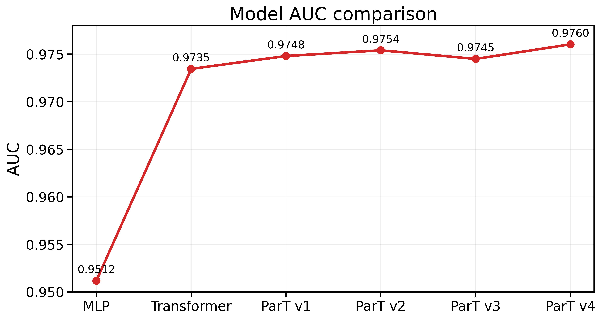
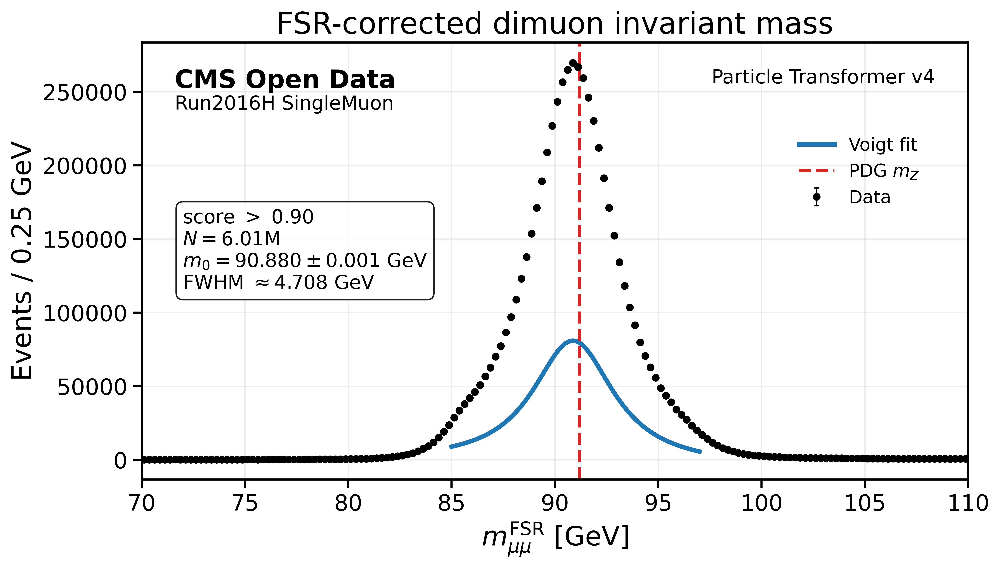

# ZMuonParT

**Z→μμ event classification with Particle Transformer using CMS 2016 Open Data**

ZMuonParT is a high-energy physics machine-learning project that applies
Transformer-based models to reconstructed CMS muon events.

The project starts from CMS Open Data ROOT files, constructs truth-labeled
muon-event datasets, compares several neural-network architectures, and applies
the best Particle Transformer model to real CMS collision data.

**CMS Open Data → event selection → truth labeling → preprocessing → model training → evaluation → real-data inference → dimuon-mass analysis**

---

## Project Status

**Completed**

Implemented components include:

- CMS ROOT data processing
- Reconstructed muon event selection
- Generator-level truth matching
- Train / validation / test dataset construction
- Feature transformation and normalization
- Baseline MLP
- Simple Transformer
- Particle Transformer v1–v4
- Pairwise physics features
- Pairwise attention bias
- ROC / AUC / background-rejection evaluation
- CMS SingleMuon real-data inference
- FSR-corrected dimuon mass reconstruction
- Threshold scans
- Breit-Wigner / Voigt mass fitting
- Presentation-quality physics plots

---

## Physics Goal

The goal is to classify reconstructed muon events according to whether they
contain a generator-level **Z→μ⁺μ⁻** decay.

The target is defined as:

- **Signal (`y = 1`)**: a truth-level Z→μμ pair exists
- **Background (`y = 0`)**: no truth-level Z→μμ pair exists

A reconstructed-level opposite-charge muon-pair requirement is applied before
the truth label is assigned.

Only reconstructed muon information is used as model input. The reconstructed
dimuon invariant mass is deliberately excluded from training and reserved for
the final physics validation on real data.

---

## Data

This project uses publicly available **CMS 2016 Open Data**
in NANOAOD / NANOAODSIM format.

Large ROOT files are not stored in this repository. Instead, the XRootD paths
of the files used in the analysis are preserved in `dataset/`.

### DYJetsToLL Monte Carlo

Dataset:

```text
/DYJetsToLL_M-50_TuneCP5_13TeV-madgraphMLM-pythia8/RunIISummer20UL16NanoAODv9-106X_mcRun2_asymptotic_v17-v1/NANOAODSIM
```

CMS Open Data record:

https://opendata.cern.ch/record/35671

ROOT file lists:

```text
dataset/DYJetsToLL_url1.txt
dataset/DYJetsToLL_url2.txt
```

Dataset summary:

| Quantity | Value |
|---|---:|
| ROOT events read | 82,448,537 |
| Reco-preselected events | 14,744,826 |
| Signal events | 13,234,058 |
| Background events | 1,510,768 |
| Signal fraction | 0.8975 |

### TTJets Monte Carlo

Dataset:

```text
/TTJets_TuneCP5_13TeV-madgraphMLM-pythia8/RunIISummer20UL16NanoAODv9-106X_mcRun2_asymptotic_v17-v1/NANOAODSIM
```

CMS Open Data record:

https://opendata.cern.ch/record/67733

ROOT file lists:

```text
dataset/TTbar_url1.txt
dataset/TTbar_url2.txt
dataset/TTbar_url3.txt
```

Dataset summary:

| Quantity | Value |
|---|---:|
| ROOT events read | 5,068,919 |
| Reco-preselected events | 579,494 |
| Signal events | 0 |
| Background events | 579,494 |

### SingleMuon Run2016H Real Data

Dataset:

```text
/SingleMuon/Run2016H-UL2016_MiniAODv2_NanoAODv9-v1/NANOAOD
```

CMS Open Data record:

https://opendata.cern.ch/record/30563

ROOT file lists:

```text
dataset/SingleMuon_url1.txt
dataset/SingleMuon_url2.txt
dataset/SingleMuon_url3.txt
dataset/SingleMuon_url4.txt
dataset/SingleMuon_url5.txt
```

Public XRootD endpoint:

```text
root://eospublic.cern.ch/
```

Relevant download scripts:

```text
src/download.py
src/download_real.py
```

---

## Event Representation

Each event contains up to **8 reconstructed muons**.

Input tensor:

```text
(batch, 8, 6)
```

Padding mask:

```text
(batch, 8)
```

Muons are sorted by decreasing transverse momentum.

### Input Features

| Feature | Description |
|---|---|
| `Muon_pt` | transverse momentum |
| `Muon_eta` | pseudorapidity |
| `Muon_phi` | azimuthal angle |
| `Muon_pfRelIso04_all` | relative PF isolation |
| `Muon_dxy` | transverse impact parameter |
| `Muon_dz` | longitudinal impact parameter |

---

## Feature Preprocessing

Feature transformations:

```text
Muon_pt
    log1p(pt)

Muon_eta
    unchanged

Muon_phi
    unchanged

Muon_pfRelIso04_all
    log1p(x)

Muon_dxy
    sign(x) * log1p(|x|)

Muon_dz
    sign(x) * log1p(|x|)
```

Normalization parameters are calculated from the training dataset only and
then applied unchanged to validation, test, and real collision data.

The normalization parameters used in the project are preserved in:

```text
processed/normalization.npz
```

---

## Dataset Pipeline

```text
CMS ROOT files
      |
      v
   dataset.py
      |
      v
truth-level Z→μμ labeling
      |
      v
merge_dataset.py
      |
      v
train / validation / test
      |
      v
feature_transform.py
      |
      v
normalization.py
      |
      v
model training
      |
      v
evaluate.py
      |
      v
ROC / AUC / background rejection
```

The train / validation / test split is stratified and uses a fixed random seed.

---

## Models

### Baseline MLP

```text
Muon features
     |
     v
Muon MLP
     |
     v
Pooling
     |
     v
Classifier
```

### Simple Transformer

```text
Muon features
     |
     v
Input projection
     |
     v
CLS token
     |
     v
Transformer encoder
     |
     v
Classifier
```

Main configuration:

```text
Embedding dimension : 128
Attention heads     : 4
Transformer layers  : 2
Feed-forward dim    : 256
```

---

## Particle Transformer

The Particle Transformer models introduce **pairwise physics information**
directly into the self-attention calculation.

The attention score is modified as

```text
Attention(i,j) = Q_i K_j^T / sqrt(d_head) + B_ij
```

where `B_ij` is a learned attention bias constructed from pairwise muon
features.

### Pairwise Features

| Model | Pairwise features |
|---|---|
| ParT v1 | Δη, Δφ |
| ParT v2 | Δη, Δφ, ΔR |
| ParT v3 | Δη, Δφ, ΔR, \|Δdxy\| |
| ParT v4 | Δη, Δφ, ΔR, \|Δdxy\|, \|Δdz\| |

The periodic azimuthal difference is calculated as

```text
Δφ = atan2(sin(φ_i - φ_j), cos(φ_i - φ_j))
```

so that it remains in `[-π, π]`.

Relevant implementations:

```text
src/pairwise_features.py
src/pairwise_attention_bias.py
src/particle_transformer_v1.py
src/particle_transformer_v2.py
src/particle_transformer_v3.py
src/particle_transformer_v4.py
```

---

## Model Performance

Performance on the held-out test dataset:

| Model | Accuracy | AUC | Background Rejection* |
|---|---:|---:|---:|
| MLP | 0.9184 | 0.95119 | 6.52 |
| Transformer | 0.9278 | 0.97345 | 11.34 |
| ParT v1 | 0.9277 | 0.97480 | **12.38** |
| ParT v2 | 0.9306 | 0.97540 | 12.02 |
| ParT v3 | **0.9324** | 0.97450 | 11.41 |
| ParT v4 | 0.9320 | **0.97603** | 11.98 |

\* Background rejection values shown here use a classification threshold of 0.5.

The largest gain occurs when moving from the MLP baseline to an
attention-based model. Adding pairwise physics information gives a further AUC
improvement, with **Particle Transformer v4 achieving the highest AUC of
0.97603**.

Different metrics do not necessarily select the same model: ParT v1 gives the
largest background rejection at the fixed threshold of 0.5.



---

## Application to Real CMS Data

Particle Transformer v4 was applied to the CMS **SingleMuon Run2016H**
collision dataset.

```text
CMS SingleMuon ROOT
        |
        v
real_dataset.py / real_dataset_fsr.py
        |
        v
Particle Transformer v4
        |
        v
event classification score
        |
        v
score threshold scan
        |
        v
dimuon invariant-mass spectrum
        |
        v
Breit-Wigner / Voigt fitting
```

Relevant scripts:

```text
src/real_dataset.py
src/real_dataset_fsr.py
src/real_inference.py
src/real_inference_fsr.py
src/analysis_real_mass.py
src/analysis_real_mass_fsr.py
src/fit_real_mass_fsr.py
```

Large event-level inference arrays are excluded from GitHub. Compact fit
summaries are preserved as CSV files under `processed/`.

---

## Dimuon Mass Validation

The classifier score was scanned over multiple thresholds and the selected
dimuon mass distributions were fitted.

The real-data analysis includes:

- standard dimuon invariant mass
- FSR-corrected dimuon invariant mass
- threshold-dependent event selection
- Breit-Wigner fits
- Voigt-profile fits
- peak-position comparison
- FWHM comparison
- selected-event statistics

For the FSR-corrected analysis, the fitted peak remains close to the expected
Z-boson mass region over a broad range of classifier thresholds.



Additional plots are available under `plots/real/`.

---

## Repository Structure

```text
ZMuonParT/
│
├── dataset/
│   └── CMS Open Data XRootD file lists
│
├── models/
│   ├── baseline_best.pt
│   ├── transformer_best.pt
│   └── particle_transformer_v1-v4_best.pt
│
├── plots/
│   ├── eda/
│   ├── ml/
│   └── real/
│
├── processed/
│   ├── dataset summaries
│   ├── normalization.npz
│   └── real-data fit summaries
│
├── src/
│   ├── dataset construction
│   ├── preprocessing
│   ├── model definitions
│   ├── training
│   ├── evaluation
│   ├── real-data inference
│   └── physics analysis
│
├── DESIGN.md
├── EDA.md
├── CHANGELOG.md
├── TODO.md
├── requirements_snapshot.txt
└── README.md
```

Large raw and processed datasets are intentionally excluded from version
control.

---

## Environment

The project was developed and executed on CERN LXPLUS / LXPLUS-GPU.

Archived environment:

```text
Python 3.9.25
PyTorch 2.8.0
NumPy 2.0.2
Awkward 2.8.12
Uproot 5.6.9
SciPy 1.13.1
scikit-learn 1.6.1
```

The complete Python environment snapshot is stored in:

```text
requirements_snapshot.txt
```

For a compatible Python / CUDA environment:

```bash
python -m pip install -r requirements_snapshot.txt
```

---

## Example Training

From the `src/` directory:

```bash
python train_particle_transformer.py \
    --version v4 \
    --epochs 5 \
    --batch-size 4096 \
    --lr 1e-4 \
    --num-workers 4
```

Evaluation:

```bash
python evaluate.py \
    --model particle_transformer_v4 \
    --batch-size 4096 \
    --num-workers 4
```

The large processed datasets required by these commands are not included in
the repository and must be regenerated from CMS Open Data.

---

## Reproducibility Notes

The repository preserves:

- source code for the analysis pipeline
- CMS Open Data dataset identifiers
- exact XRootD ROOT file lists used in the project
- preprocessing and normalization code
- normalization constants
- trained model checkpoints
- final plots
- compact real-data fit results
- Python environment snapshot

Large ROOT files, generated training datasets, model test-score arrays, and
real-data event-level inference arrays are excluded because of their size.

---

## Summary

This project demonstrates an end-to-end application of deep learning to
high-energy physics data:

1. CMS Open Data processing
2. physics-motivated event labeling
3. reconstructed-muon feature preprocessing
4. Transformer-based event classification
5. pairwise attention using physics observables
6. systematic comparison of MLP, Transformer, and Particle Transformer models
7. application of the trained classifier to real CMS collision data
8. validation through the reconstructed Z→μμ invariant-mass spectrum

**Best test AUC: Particle Transformer v4 — 0.97603**
